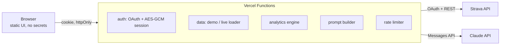

# Trail.AI

Endurance training analytics on Strava data, with an LLM coach that only reasons over metrics computed server-side.

**Live demo:** https://trail-dashboard-one.vercel.app/?mode=demo (fictional athlete, 16 weeks of synthetic data)


## What it does

You write *"good run this morning, heavy legs at the start"*. The coach identifies which Strava activity you mean, pulls its second-by-second streams, and crosses your feeling with objective markers: cardiac drift, time in zones, current training load, and aerobic efficiency trend.

| Metric | Definition | Why it matters |
|---|---|---|
| **Efficiency Factor (EF)** | speed (m/min) ÷ average HR, on flat aerobic runs ≥ 20 min | Aerobic fitness: more speed per heartbeat. Filtering on comparable efforts removes terrain and intensity noise. |
| **TRIMP** (Banister) | minutes × HRr × 0.64 × e^(1.92·HRr) | Internal load of a session, weighting intensity exponentially. |
| **ACWR** | 7-day load ÷ (28-day load / 4) | Load spikes vs. what the body is adapted to. 0.8-1.3 = sweet spot, > 1.5 = elevated injury risk. |
| **Aerobic decoupling (Pa:HR)** | EF of 2nd half vs 1st half, after a 10-min warm-up | Aerobic durability. < 5 % = well-developed endurance at that duration. |
| **Time in zones** | 5-zone %HRmax model on streams | Checks that "easy" runs are actually easy. |

## Architecture



```
public/            static frontend (vanilla JS + Chart.js)
  js/analytics.js  pure metric functions, shared by browser and server
  js/demo-data.js  deterministic synthetic athlete (seeded PRNG, Strava-shaped)
  js/app.js        UI
api/               serverless endpoints
  auth/login       → Strava consent, CSRF state cookie
  auth/callback    → code exchange server-side, encrypted session
  activities       → activities + HR profile (demo or live)
  streams          → per-second streams of one activity
  chat             → coach reply
lib/               session crypto, Strava client, prompt builder, rate limiter
tests/             node:test unit tests (metrics + session crypto)
```

## Design decisions

**Secrets never reach the browser.** The OAuth code exchange and token refresh run in serverless functions. Tokens live in an AES-256-GCM encrypted, `httpOnly`, `Secure`, `SameSite=Lax` cookie: the client holds an opaque blob it can neither read nor forge. No database needed: the session is stateless.

**The model is grounded, not trusted with raw input.** The browser sends only the conversation text. The server fetches the athlete's data itself, computes the metrics, and builds the system prompt. A user cannot inject fake training data, and every recommendation must cite a number from that context.

**Private context is owner-only.** Injury history and race plan live in an environment variable and are added to the prompt only when the authenticated Strava athlete id matches `OWNER_ATHLETE_ID`. They are never committed, never sent to the browser.

**One code path for demo and live.** The demo generator emits Strava-shaped objects, so the same analytics, prompt builder and UI run on both. Recruiters can try the full product without a Strava account, and the demo is a living integration test.

**Cost and abuse controls.** Demo chat uses a smaller model and is rate-limited per IP plus a global daily cap; the system prompt is cached across turns (prompt caching). The in-memory limiter is per warm instance; a shared store (Upstash/Vercel KV) is the next step for hard guarantees.

**Defensive defaults.** OAuth `state` check, strict input validation on the chat endpoint, model output escaped before rendering (no XSS via markdown), CSP and security headers in `vercel.json`, uniform error handling with no stack traces leaked.

## Known limits and next steps

- EF does not use grade-adjusted pace; trail runs with significant D+ are excluded rather than corrected. Next: grade-adjusted speed from altitude streams.
- %HRmax zones are a simplification; a lactate or ventilatory threshold test would personalize them.
- Strava apps start in single-athlete mode; multi-user access requires Strava's app review.
- Streaming responses (SSE) for the coach, and a persistent store to track conversations over time.

## Run locally

```bash
cp .env.example .env   # fill in values
npx vercel dev          # serves public/ and api/ on http://localhost:3000
npm test
```

## Environment variables

| Name | Required | Purpose |
|---|---|---|
| `STRAVA_CLIENT_ID`, `STRAVA_CLIENT_SECRET` | live mode | Strava app credentials |
| `SESSION_SECRET` | live mode | ≥ 32 random chars, encrypts the session cookie |
| `ANTHROPIC_API_KEY` | coach | Claude API key |
| `ANTHROPIC_MODEL`, `ANTHROPIC_DEMO_MODEL` | no | model overrides |
| `OWNER_ATHLETE_ID`, `HR_MAX`, `HR_REST`, `ATHLETE_CONTEXT` | no | owner-only personalization |
| `APP_URL` | no | canonical URL for the OAuth redirect |

---
Built by Justin Seriat.
